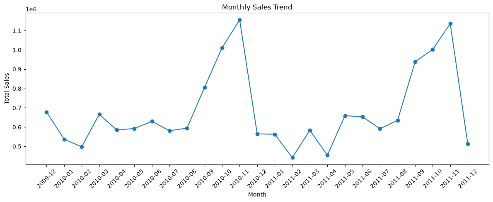
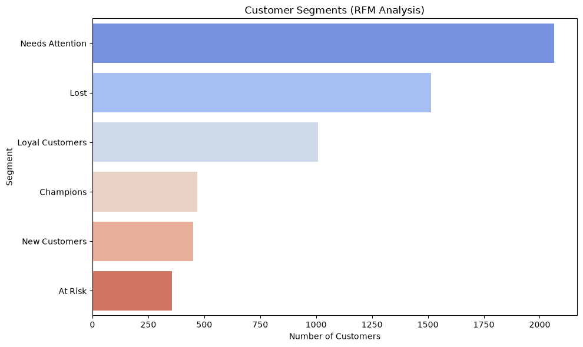

# Customer Analytics: RFM Segmentation

A customer segmentation analysis on ~2 years of UK-based online retail transaction data, using RFM (Recency, Frequency, Monetary) analysis to identify high-value, at-risk, and lost customer segments.

## 📊 Dataset

- **Source:** [Online Retail II — Kaggle](https://www.kaggle.com/datasets/mashlyn/online-retail-ii-uci)
- **Size:** ~1.07M raw transactions (Dec 2009 – Dec 2011), cleaned down to ~776K valid customer purchases
- Raw and cleaned CSVs are excluded from this repo (see `.gitignore`) due to file size — download directly from Kaggle to reproduce.

## 🛠️ Tools Used

- Python
- Pandas (data cleaning, feature engineering, aggregation)
- Matplotlib & Seaborn (visualization)
- Jupyter Notebooks (VS Code)

## 🔍 Approach

1. **Data Cleaning** (`01_data_cleaning.ipynb`)
   - Removed duplicate transactions, rows with missing Customer IDs, returns (negative quantity), missing product descriptions, non-product stock codes (postage, fees), and invalid prices
   - Converted Customer ID to a clean integer type

2. **Feature Engineering**
   - Created `TotalPrice` (Quantity × Price)
   - Extracted `Year`, `Month`, `DayOfWeek` from invoice timestamps

3. **Exploratory Analysis** (`02_exploratory_analysis.ipynb`)
   - Monthly sales trend
   - Top 10 products by revenue
   - Top 10 customers by spend

4. **RFM Segmentation**
   - Calculated Recency, Frequency, and Monetary value per customer
   - Scored each metric on a 1–5 scale using quantile binning
   - Classified customers into segments: Champions, Loyal Customers, New Customers, At Risk, Needs Attention, Lost

## 📈 Key Findings

| Segment | Customers | Description |
|---|---|---|
| Needs Attention | 2,064 | Mid-engagement, could go either way |
| Lost | 1,514 | Long inactive, low historical engagement |
| Loyal Customers | 1,008 | Buy often and recently |
| Champions | 469 | Best customers — recent, frequent, high spend |
| New Customers | 451 | Recently started buying, low frequency so far |
| At Risk | 355 | Previously high-value, gone quiet — win-back candidates |

### Monthly Sales Trend

*Clear seasonal spikes each November (likely holiday shopping), with December appearing low only because the dataset ends Dec 9, 2011 — not a real decline.*

### Customer Segments

## 💡 Recommendation

Prioritize a targeted re-engagement campaign for the **At Risk** segment — these customers have a strong historical spending pattern and are more likely to respond to a win-back offer than customers already fully **Lost**.

## 📁 Files

- `01_data_cleaning.ipynb` — data cleaning & feature engineering
- `02_exploratory_analysis.ipynb` — EDA, visualizations, and RFM segmentation
- `customer_segments_rfm.csv` — final output: one row per customer with RFM scores and segment label
